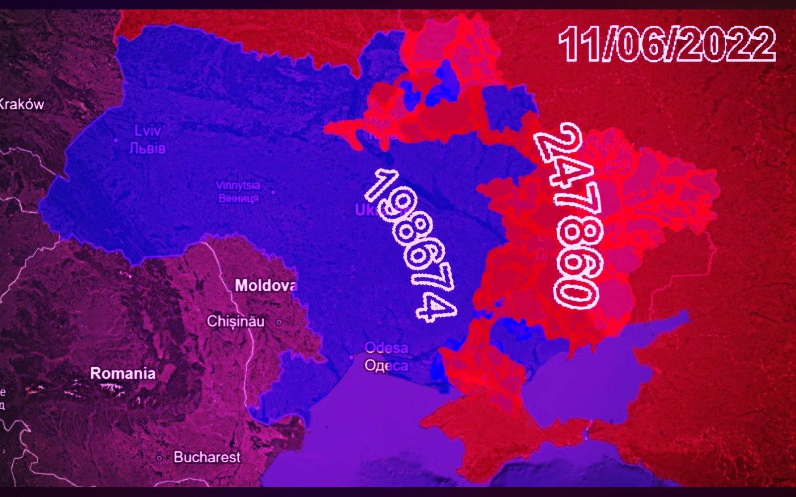

# ProMotion Draw: Strategy Mapping Tool

This is a small, client-side software tool designed for strategy mapping and visual planning.

### The Backstory

I want to be clear about how this was built: the idea, the logic, and the "how-to" workflow came from my head, but I didn't write the actual lines of code. I used AIs like Gemini, Claude, and Replit to do the heavy lifting on the programming side. It is basically a collaboration where I acted as the architect and they acted as the builders.

### What it does

It’s a simple drawing and mapping tool that lives entirely in the browser. It’s meant for drawing out zones, paths, and strategy maps.

* **Drawing Tools:** Brush, eraser, and a polygon tool for defining specific areas.
* **Timeline & Keyframes:** It has a CapCut-style timeline. You can set keyframes to animate or transition your view across the map.
* **Layers:** Organize different parts of your strategy on separate layers.
* **Workspace:** You can pan and zoom around the canvas just like a professional design tool.

### See it in action

I’ve been using this to create actual strategy videos. Here is a look at what the output looks like:

[A YT Video made with this software](https://youtu.be/_ykdxwIKzYs)

### How to run it

Since this is a client-side app, there is no complicated setup.

1. Download the project.
2. Open `index.html` in any modern web browser.
3. Start mapping.

### Credits

* **Concept and Direction:** Me.
* **Code:** Gemini, Claude, and Replit.

It’s not some massive corporate software. It’s a focused tool built to do one job well. Use it, break it, or tweak it.
